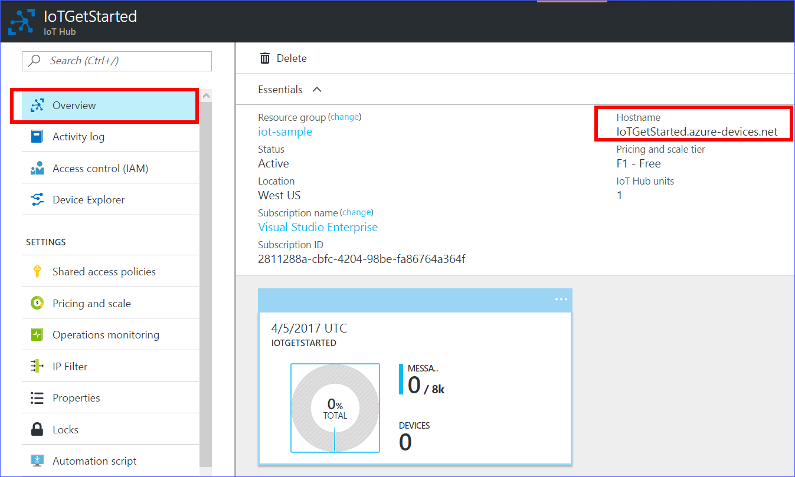
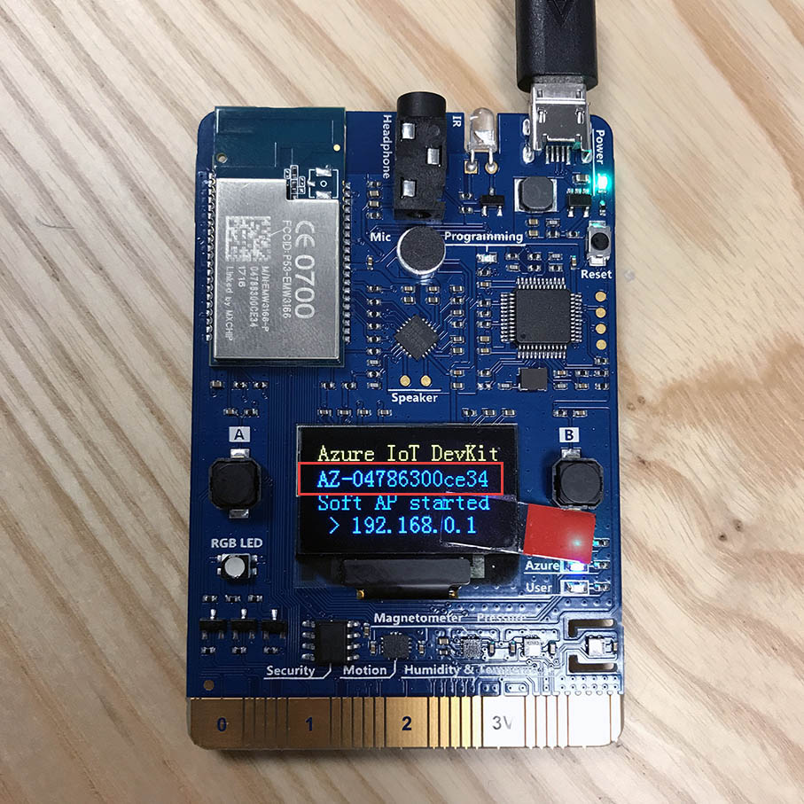

# Connect MXChip IoT Developer Kit to Azure IoT Hub in the cloud

## What you do

Connect MXChip IoT Developer Kit to an IoT hub that you create. Then you run a sample application to collect the temperature and humidity data from a sensor. Finally, you send the sensor data to your IoT hub.

## What you learn

* How to create an IoT hub and register a device for MXChip IoT Developer Kit
* How to collect sensor data by running a sample application on MXChip IoT Developer Kit
* How to send the sensor data to your IoT hub

## What you need

To complete this operation, you need the following parts from your MXChip IoT Developer Kit Starter Kit:

* The MXChip IoT Developer Kit board (firmware version 0.8.2+)
* A Micro USB to Type A USB cable

You also need the following things for your development environment:

* Mac or PC that is running Windows or Ubuntu.
* Wireless network for MXChip IoT Developer Kit to connect to.
* Internet connection to download the configuration tool.
* [Visual Studio Code](https://code.visualstudio.com/)
* [Arduino Extension](https://marketplace.visualstudio.com/items?itemName=vsciot-vscode.vscode-arduino)

## Create an IoT hub and register a device for MXChip IoT Developer Kit

### Create an IoT hub

1. In the [Azure portal](https://portal.azure.com/), click **New** > **Internet of Things** > **IoT Hub**.

   
1. In the **IoT hub** pane, enter the following information for your IoT hub:

   **Name**: It is the name for your IoT hub. If the name you enter is valid, a green check mark appears.

   **Pricing and scale tier**: Select the free F1 tier. This option is sufficient for this demo. See [pricing and scale tier](https://azure.microsoft.com/pricing/details/iot-hub/).

   **Resource group**: Create a resource group to host the IoT hub or use an existing one. See [Using resource groups to manage your Azure resources](https://docs.microsoft.com/en-us/azure/azure-resource-manager/resource-group-portal.md).

   **Location**: Select the closest location to you where the IoT hub is created.

   **Pin the dashboard**: Check this option for easy access to your IoT hub from the dashboard.

   

1. Click **Create**. It could take a few minutes for your IoT hub to be created. You can see progress in the **Notifications** pane.

   

1. Once your IoT hub is created, click it from the dashboard. Make a note of the **Hostname**, and then click **Shared access policies**.

   

1. In the **Shared access policies** pane, click the **iothubowner** policy, and then copy and make a note of the **Connection string** of your IoT hub. For more information, see [Control access to IoT Hub](https://docs.microsoft.com/en-us/azure/iot-hub/iot-hub-devguide-security.md).

   

### Register a device in the IoT hub for the your device

1. In the [Azure portal](https://portal.azure.com/), open your IoT hub.
1. Click **Device Explorer**.
1. In the Device Explorer pane, click **Add** to add a device to your IoT hub.

   **Device ID**: The ID of the new device.

   **Authentication Type**: Select **Symmetric Key**.

   **Auto Generate Keys**: Check this field.

   **Connect device to IoT Hub**: Click **Enable**.

   

1. Click **Save**.
1. After the device is created, open the device in the **Device Explorer** pane.
1. Make a note of the primary key of the connection string.

   

## Connect MXChip IoT Developer Kit with your computer

Use the Micro USB to Type A USB cable to connect MXChip IoT Developer Kit to your computer.

## Collect sensor data and send it to your IoT hub

In this section, you deploy and run a sample application on MXChip IoT Developer Kit. The sample application blinks the LED on MXChip IoT Developer Kit, and sends the temperature and humidity data collected from the sensor to your IoT hub.

### Get the sample application 

1. In the Visual Studio Code, press `F1` or `Ctrl + Shift + P` to open command palette, type `Arduino: Examples`.
1. In `Arduino Examples` tab, navigate to `Examples for MXChip AZ3166` > `AzureIoTHub` and click on `GetStarted`.

### Install the package for MXChip IoT Developer Kit in the Visual Studio Code:

1. In the Visual Studio Code, press `F1` or `Ctrl + Shift + P` to open command palette, type `Arduino: Boards Manager`.
1. In `Arduino Boards Manager`, search for `AZ3166`, then click `Install`.
1. In Status Bar at the bottom, click `<Select Borad Type>`, then select `MXCHIP AZ3166`.

### Install necessary libraries

1. In the Visual Studio Code, press `F1` or `Ctrl + Shift + P` to open command palette, type `Arduino: Libraries Manager`.
1. Search for the following library names one by one. For each of library that you find, click **Install**.
   * `ArduinoJson`

### Config Wifi

Most IoT projects are relying on Internet connectivity. Use AP (Access Point) Mode on DevKit to configure WiFi.

#### A. Enter AP Mode

Hold down button B, click Reset button, then release button B. The screen will display SSID of the DevKit as well as the configuration portal IP address:



#### B. Connect to DevKit AP

Use your computer or mobile phone to connect to DevKit AP (highlighted in the screenshot above), leave the password as empty.

#### C. Configure WiFi for DevKit

Open IP address on the screen in browser, select WiFi you want your DevKit connect to, then type the password. Click **'Connect'** to configure and connect to WiFi.


Once the connection is succeeded, the DevKit will reboot in a few seconds. After reboot, you can test the connection by clicking button A. The WiFi SSID and IP address will display on the screen.


**Note:** The IP address displays on the web page might not be identical to the actual IP address assigned and displayed on screen. This is normal as the WiFi is using DHCP to dynamically IP assignment.

### Configure device connection string to DevKit (Windows)

1. Download [Putty](http://www.putty.org/)

1. Open Putty, in `Connection type`, select `Serial`, in `Serial line`, enter your Serial Port name, in `Speed`, enter `115200`, then click `Open` button

   

1. Get into configuration mode: Hold down button A, then push and release the reset button.

1. In the prompt of the serial port with `#`, configure your connection string you get from previous step:
  ```bash
  set_az_iothub [your connection string]
  ```
  You will see the information once configuration is successful:
  ```bash
  INFO: Set Azure Iot hub connection string successfully.
  ```
  Now close the Putty.


### Deploy the sample application to MXChip IoT Developer Kit

1. In the Visual Studio Code, in Status Bar at the bottom, click `<Select Serial Port>`, and then click the serial port `STMicroelectronics` for MXChip IoT Developer Kit.
1. Press `F1` or `Ctrl + Shift + P` to open command palette, type `Arduino: Upload` to build and deploy the sample application to MXChip IoT Developer Kit.

### Verify the sample application is running successfully

If you see the following output from the serial monitor window and the blinking LED on MXChip IoT Developer Kit, the sample application is running successfully.


## Next steps

You have successfully connected a MXChip IoT Developer Kit to your IoT hub, and sent the captured sensor data to your IoT hub.

To continue getting started with IoT Hub and to explore other IoT scenarios, see:

- [Manage cloud device messaging with iothub-explorer](https://docs.microsoft.com/en-us/azure/iot-hub/iot-hub-explorer-cloud-device-messaging)
- [Save IoT Hub messages to Azure data storage](https://docs.microsoft.com/en-us/azure/iot-hub/iot-hub-store-data-in-azure-table-storage)
- [Use Power BI to visualize real-time sensor data from Azure IoT Hub](https://docs.microsoft.com/en-us/azure/iot-hub/iot-hub-live-data-visualization-in-power-bi).
- [Use Azure Web Apps to visualize real-time sensor data from Azure IoT Hub](https://docs.microsoft.com/en-us/azure/iot-hub/iot-hub-live-data-visualization-in-web-apps).
- [Weather forecast using the sensor data from your IoT hub in Azure Machine Learning](https://docs.microsoft.com/en-us/azure/iot-hub/iot-hub-weather-forecast-machine-learning)
- [Device management with iothub-explorer](https://docs.microsoft.com/en-us/azure/iot-hub/iot-hub-device-management-iothub-explorer)
- [Remote monitoring and notifications with ​​Logic ​​Apps](https://docs.microsoft.com/en-us/azure/iot-hub/iot-hub-monitoring-notifications-with-azure-logic-apps)
